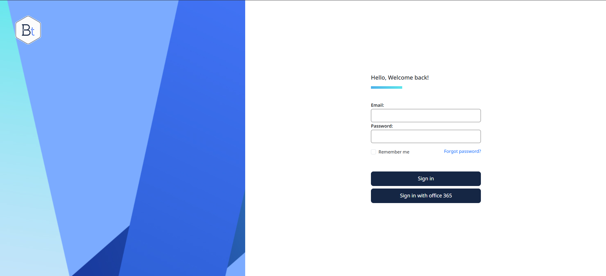
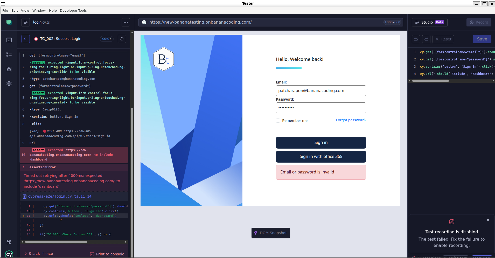
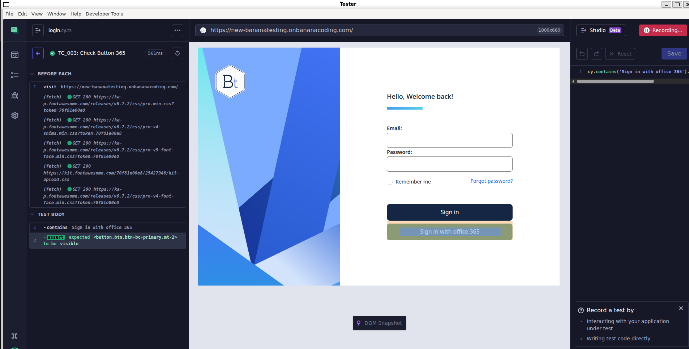
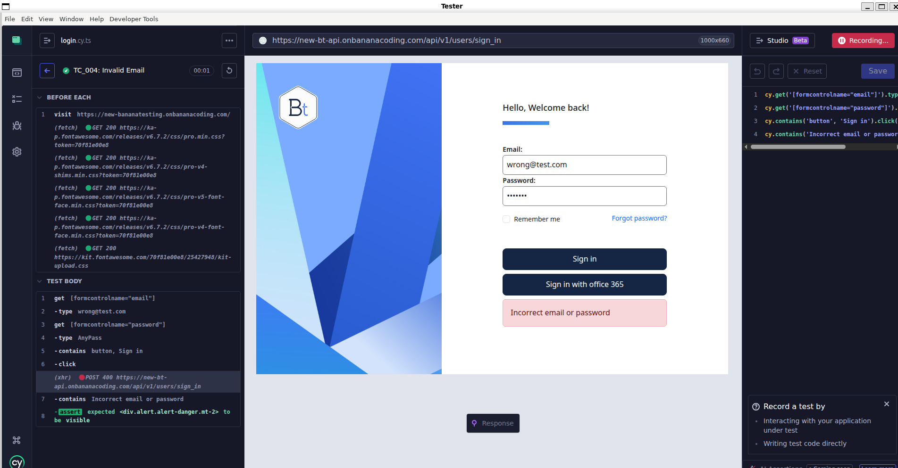
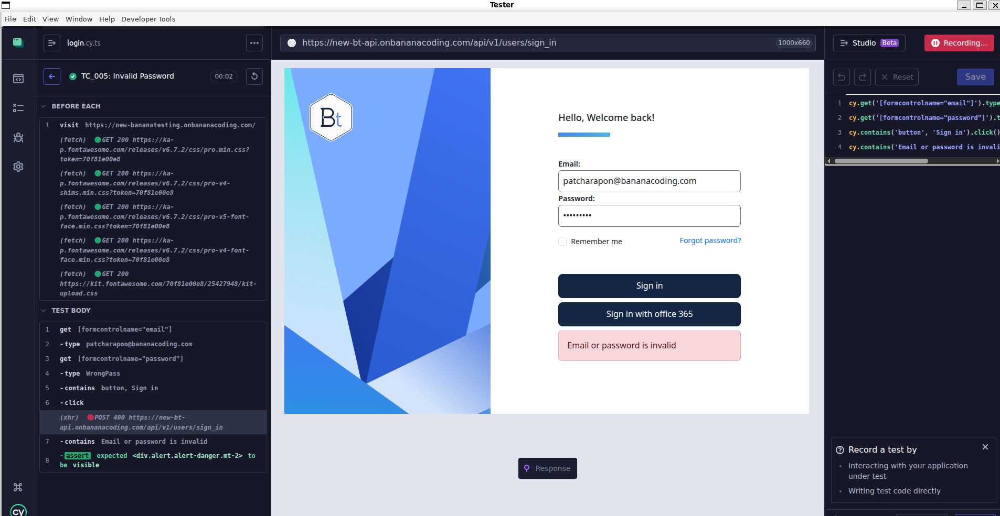
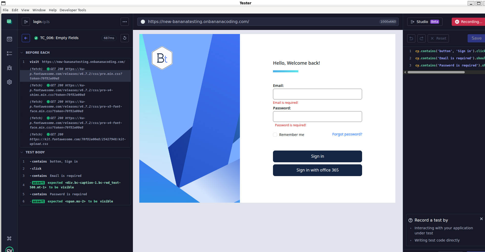

# Tester_Bananacoding

## 📋 Test Execution Report

### Summary

| Status              | Count |
| :------------------ | :---- |
| **PASSED**          | 19    |
| **FAILED**          | 1     |
| **Unable for Test** | 0     |

---
## 🖼️ Test Screenshots

### Login Page Interface

หน้าจอเข้าสู่ระบบของเว็บไซต์ แสดงองค์ประกอบต่างๆ ที่ใช้ในการทดสอบ TC_001

**องค์ประกอบที่แสดง:**

- โลโก้ Bt
- Title "Hello, Welcome back!"
- ช่องกรอก Email
- ช่องกรอก Password
- Checkbox "Remember me"
- Link "Forgot password?"
- ปุ่ม Sign in
- ปุ่ม Sign in with Office 365

---

### TC_002: ผู้ใช้เข้าสู่ระบบสำเร็จจากปุ่ม Sign in

ผลการทดสอบการเข้าสู่ระบบด้วย Email และ Password ที่ถูกต้อง

**สถานะ:** FAILED    
**หมายเหตุ:** Server มีปัญหาทำให้ไม่สามารถกรอก Email/Password ถูกต้องและกดปุ่ม Sign in ได้

---

### TC_003: ผู้ใช้เข้าสู่ระบบสำเร็จจากปุ่ม Sign in with Office 365

ผลการทดสอบการเข้าสู่ระบบผ่าน Microsoft Office 365

**สถานะ:** PASSED ✅  
**ผลลัพธ์:** ระบบรีไดเร็กต์ไปยังหน้า Login ของ Microsoft และเข้าสู่ระบบสำเร็จ

---

### TC_004: ผู้ใช้เข้าสู่ระบบไม่สำเร็จ - กรอก Email ผิด

ผลการทดสอบเมื่อผู้ใช้กรอก Email ที่ไม่ถูกต้อง

**สถานะ:** PASSED ✅  
**ผลลัพธ์:** ระบบแสดงข้อความแจ้งเตือน "ไม่พบอีเมลในระบบ" และผู้ใช้ยังคงอยู่ที่หน้า Login

---

### TC_005: ผู้ใช้เข้าสู่ระบบไม่สำเร็จ - กรอก Password ผิด

ผลการทดสอบเมื่อผู้ใช้กรอก Password ที่ไม่ถูกต้อง

**สถานะ:** PASSED ✅  
**ผลลัพธ์:** ระบบแสดงข้อความแจ้งเตือน "รหัสผ่านไม่ถูกต้อง" และผู้ใช้ยังคงอยู่ที่หน้า Login

---

### TC_006: ผู้ใช้เข้าสู่ระบบไม่สำเร็จ - ไม่กรอกข้อมูล

ผลการทดสอบเมื่อผู้ใช้ไม่กรอกข้อมูลใดๆ

**สถานะ:** PASSED ✅  
**ผลลัพธ์:** ระบบแสดงข้อความแจ้งเตือนให้กรอกข้อมูล (Required Field Validation) ที่ใต้ช่อง Email และ Password

---

## 📊 Detailed Test Scenarios

### TS_001: ผู้ใช้เข้าสู่ระบบ

| TC ID      | Test Case Description                           | Test Step                                                       | Expected Result                                                                                                                                                                                                                                                        | Status              | Date       | Notes                                                                     |
| :--------- | :---------------------------------------------- | :-------------------------------------------------------------- | :--------------------------------------------------------------------------------------------------------------------------------------------------------------------------------------------------------------------------------------------------------------------- | :------------------ | :--------- | :------------------------------------------------------------------------ |
| **TC_001** | ตรวจสอบการแสดงผลหน้าเว็บไซต์                    | 1. เปิดเว็บไซต์ "https://new-bananatesting.onbananacoding.com/" | 1. ระบบควรจะแสดงหน้าเว็บไซต์ รายละเอียดดังนี้ 1.1 โลโก้ Bt 1.2 Title "Hello, Welcome back!" 1.3 ช่องกรอก Email 1.4 ช่องกรอก Password 1.5 checkbox "Remember me" 1.6 link "Forgot password?" 1.7 ปุ่ม Sign in 1.8 ปุ่ม Sign in with officer 365 | **PASSED**          | 20/11/2025 |                                                                           |
| **TC_002** | ผู้ใช้เข้าสู่ระบบสำเร็จจากปุ่ม Sign in          | กรอก Email/Pass ถูกต้อง และกดปุ่ม Sign in                       | 1. ระบบตรวจสอบข้อมูลสำเร็จ 2. นำผู้ใช้งานเข้าสู่หน้าหลัก (Dashboard/Homepage)                                                                                                                                                                                       | **Unable for Test** | 22/11/2025 | server มีปัญหาทำให้ไม่สามารถกรอก Email/Pass ถูกต้อง และกดปุ่ม Sign in ได้ |
| **TC_003** | ผู้ใช้เข้าสู่ระบบสำเร็จจากปุ่ม Sign in with 365 | กดปุ่ม Sign in with office 365                                  | 1. ระบบรีไดเร็กต์ (Redirect) ไปยังหน้า Login ของ Microsoft 2. เมื่อ Login สำเร็จ ระบบนำผู้ใช้งานเข้าสู่หน้าหลักทันที                                                                                                                                                | **PASSED**          | 22/11/2025 |                                                                           |
| **TC_004** | ผู้ใช้เข้าสู่ระบบไม่สำเร็จ -> กรอก Email ผิด    | กรอก Email ผิด, กรอก Password (อะไรก็ได้), แล้วกดปุ่ม Sign in   | 1. ระบบแสดงข้อความแจ้งเตือนว่า "ไม่พบอีเมลในระบบ" (หรือข้อความตามที่ UI แจ้ง) 2. ผู้ใช้ยังคงอยู่ที่หน้า Login                                                                                                                                                       | **PASSED**          | 22/11/2025 |                                                                           |
| **TC_005** | ผู้ใช้เข้าสู่ระบบไม่สำเร็จ -> กรอก Password ผิด | กรอก Email ถูกต้อง แต่กรอก Password ผิด และกดปุ่ม Sign in       | 1. ระบบแสดงข้อความแจ้งเตือนว่า "รหัสผ่านไม่ถูกต้อง" 2. ผู้ใช้ยังคงอยู่ที่หน้า Login                                                                                                                                                                                 | **PASSED**          | 22/11/2025 |                                                                           |
| **TC_006** | ผู้ใช้เข้าสู่ระบบไม่สำเร็จ -> ไม่กรอกข้อมูล     | ไม่กรอกข้อมูลใดๆ และกดปุ่ม Sign in                              | 1. ระบบแสดงข้อความแจ้งเตือนให้กรอกข้อมูล (Required Field Validation) ที่ใต้ช่อง Email และ Password                                                                                                                                                                     | **PASSED**          | 22/11/2025 |                                                                           |

