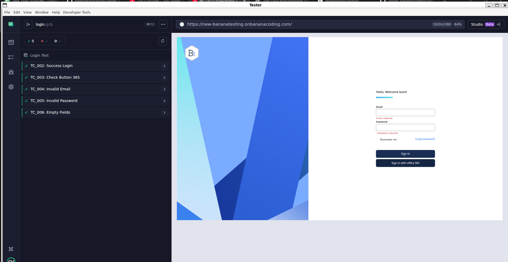
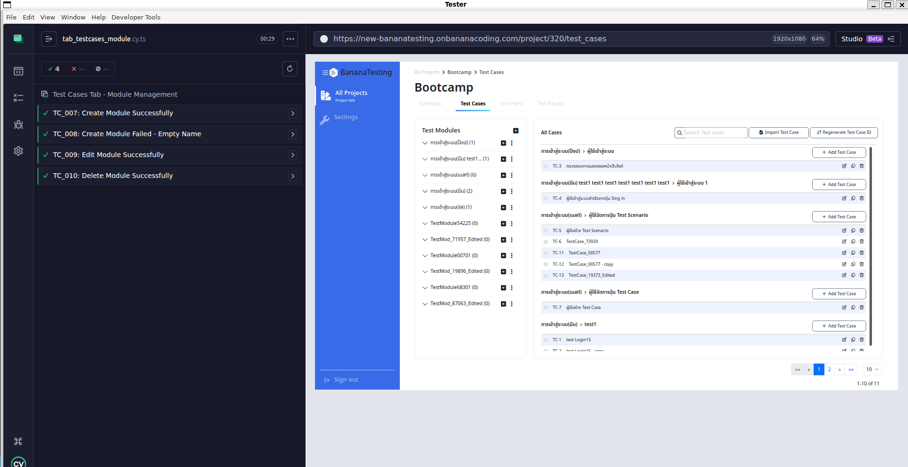
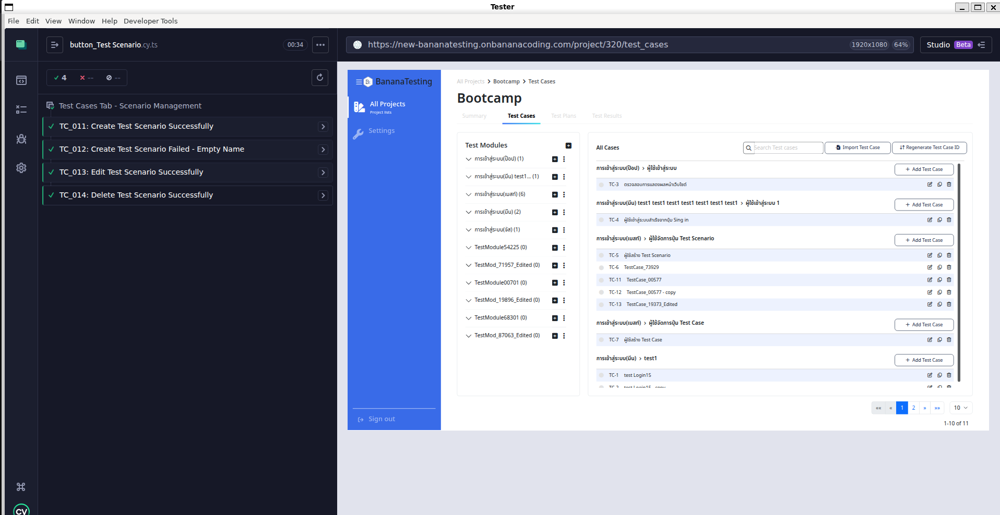
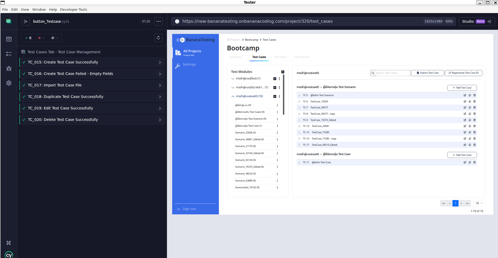

# Automated Testing - BananaTesting

## Test Execution Status

| Status              | Count |
| :------------------ | :---- |
| **PASSED**          | 20    |
| **FAILED**          | 0     |
| **Unable for Test** | 0     |

---

## Test Suites Overview

### 1. User Login (TS_001)

**Focus:** Verify login functionality including success, failure, and UI validation.

- **TC_001**: Verify Login Page UI
- **TC_002**: Login Success (Standard)
- **TC_003**: Login Success (Office 365)
- **TC_004**: Login Failed (Invalid Email)
- **TC_005**: Login Failed (Invalid Password)
- **TC_006**: Login Failed (Empty Fields)

### 2. Test Cases Tab - Modules (TS_002)

**Focus:** Manage Test Modules (Create, Edit, Delete).

- **TC_007**: Create Module Successfully
- **TC_008**: Create Module Failed (Empty Name)
- **TC_009**: Edit Module Name
- **TC_010**: Delete Module

### 3. Test Scenario Management (TS_003)

**Focus:** Manage Test Scenarios within Modules.

- **TC_011**: Create Scenario Successfully
- **TC_012**: Create Scenario Failed (Empty Name)
- **TC_013**: Edit Scenario Name
- **TC_014**: Delete Scenario

### 4. Test Case Management (TS_004)

**Focus:** Manage individual Test Cases (Create, Import, Duplicate, Edit, Delete).

- **TC_015**: Create Test Case Successfully
- **TC_016**: Create Test Case Failed (Empty Fields)
- **TC_017**: Import Test Case from File
- **TC_018**: Duplicate Test Case
- **TC_019**: Edit Test Case
- **TC_020**: Delete Test Case
